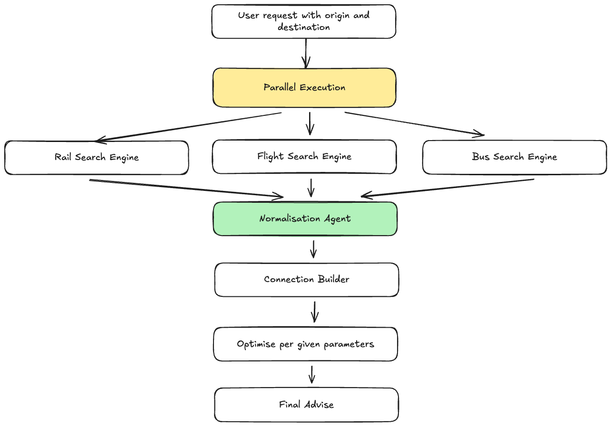

# Hi, I’m Daria (Dasha)

**Applied AI / Machine Learning Engineer**  
I build data-driven, human-centered ML products, with a strong focus on delivery.

👉 **Portfolio:** [koalaboomka.github.io](https://koalaboomka.github.io/)

---

### What I work with

- Applied ML (including multimodal)
- GenAI & agent-based systems
- Embeddings & product analytics
- Delivery leadership for ML-driven products

---

### Featured work

**Cross-border agent planner**

  

*Co-developed a multi-agent planning system to construct complex cross-border travel itineraries using Gemini-powered agents for reasoning, retrieval, and tool orchestration.*

---

**Streaming awards analytics (Netflix & Disney)**

  

*Analyzed how award-winning content (Oscars, Golden Globes) is distributed across Netflix and Disney catalogs by merging multiple public datasets.*

---

### Profiles
[GitHub](https://github.com/KoalaBoomka) ·
[Kaggle](https://www.kaggle.com/koalaboomka) ·
[LeetCode](https://leetcode.com/u/KoalaBoomka/) ·
[LinkedIn](https://www.linkedin.com/in/daria-tsarova-lenska) ·
[Email](mailto:d.tsarova.lenska@proton.me)

---

Personal note: I have several cats. Most of them are named after apple pies.
